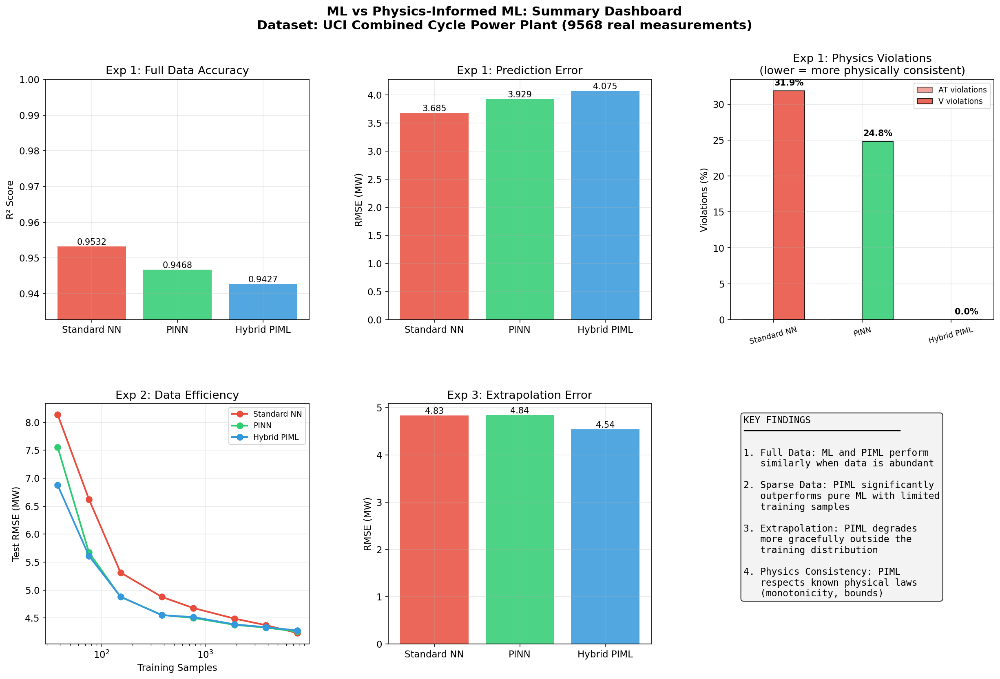
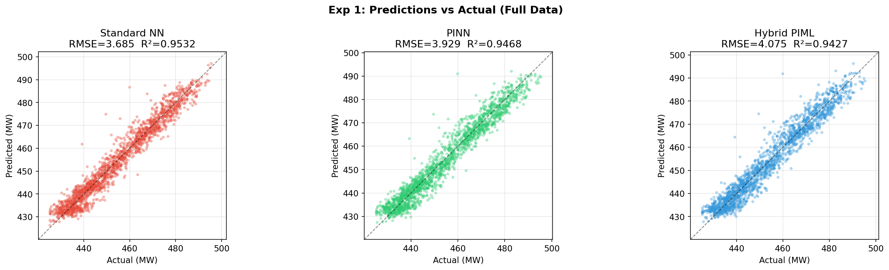
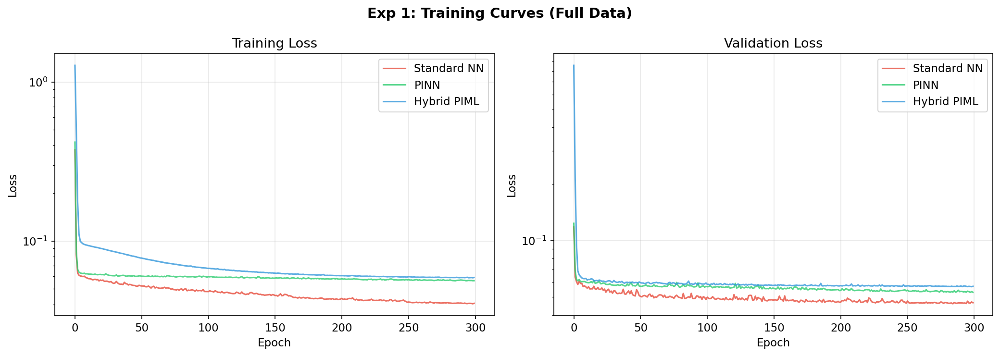
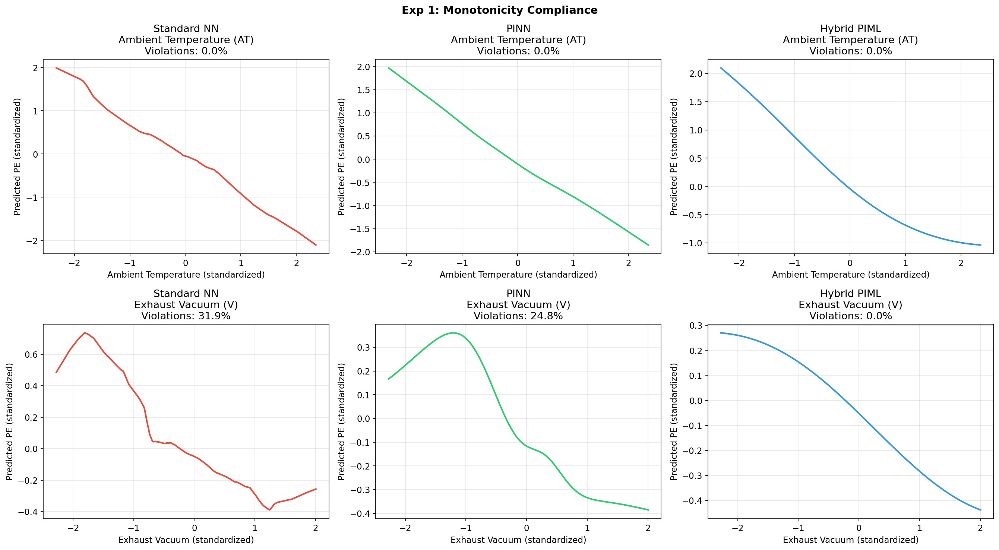
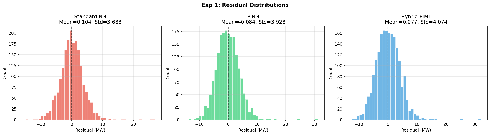
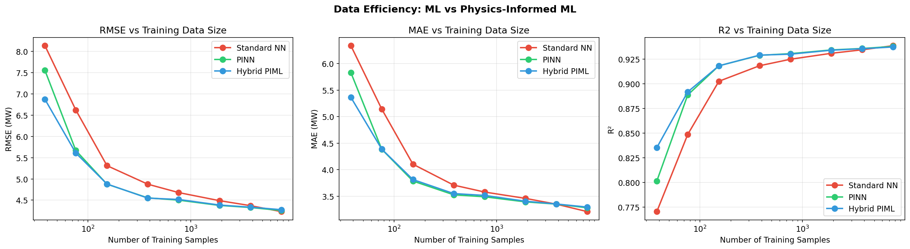
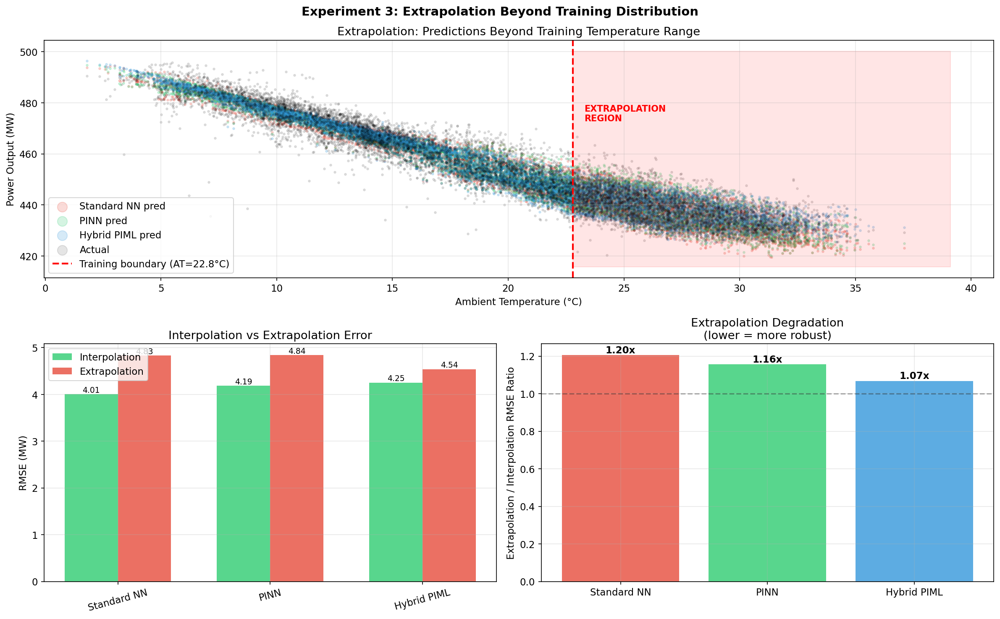

# ML vs Physics-Informed ML: A Comparison

This repo shows the differences between standard machine learning and **physics-informed machine learning (PIML)** using **data** from the [UCI Combined Cycle Power Plant dataset](https://archive.ics.uci.edu/dataset/294/combined+cycle+power+plant) (9,568 measurements collected from a gas turbine power plant over 6 years).

Three models are compared across three experiments:

- **Standard NN** — pure data-driven neural network (ReLU activations)
- **PINN** — physics-informed neural network (same architecture + thermodynamic loss terms)
- **Hybrid PIML** — physics backbone with guaranteed monotonicity + small NN correction



---

## Quick Start

```bash
# Clone and install
uv sync

# Run all experiments (~8 minutes)
uv run python run_all.py
```

Results (plots + metrics) are saved to `results/`.

To run a single experiment:

```bash
uv run python experiments/exp1_full_comparison.py
uv run python experiments/exp2_sparse_data.py
uv run python experiments/exp3_extrapolation.py
```

---

## Dataset

The UCI Combined Cycle Power Plant dataset is automatically downloaded on first run.

| Feature | Description | Unit |
|---|---|---|
| AT | Ambient Temperature | °C |
| V | Exhaust Vacuum | cm Hg |
| AP | Ambient Pressure | mbar |
| RH | Relative Humidity | % |
| **PE** | **Net Electrical Energy Output (target)** | **MW** |

**Known physics:**
- Higher ambient temperature reduces Carnot efficiency, so **PE decreases with AT**
- Higher exhaust vacuum reduces condenser efficiency, so **PE decreases with V**
- These are fundamental thermodynamic laws that PIML models encode

---

## Experiment 1: Full Data Comparison

**Setup:** 7,654 training / 1,914 test samples, no noise.

| Model | RMSE (MW) | MAE (MW) | R² |
|---|---|---|---|
| Standard NN | **3.685** | **2.782** | **0.9532** |
| PINN | 3.929 | 3.048 | 0.9468 |
| Hybrid PIML | 4.075 | 3.179 | 0.9427 |

With abundant clean data, all models perform well. Standard NN has a slight accuracy edge because physics constraints add regularization that isn't needed here.

**But accuracy isn't the whole story.** Look at physics consistency:

| Model | AT Monotonicity Violations | V Monotonicity Violations |
|---|---|---|
| Standard NN | 0.0% | **31.9%** |
| PINN | 0.0% | 24.8% |
| Hybrid PIML | 0.0% | **0.0%** |

The Standard NN violates the known physical law (PE should decrease with vacuum) nearly a third of the time. The Hybrid PIML, with architecturally guaranteed monotonicity, has zero violations.







The bottom row shows the Standard NN's non-monotonic (non-physical) response to exhaust vacuum, while the Hybrid PIML maintains a clean decreasing curve.



---

## Experiment 2: Sparse + Noisy Data

**Setup:** Varying training sizes from 38 to 7,654 samples. Gaussian sensor noise (10 MW std, ~2% of output) added to training targets. Test set is clean. Averaged over 3 random seeds.

This is where PIML truly shines. Physics constraints act as both **regularizer** (preventing overfitting to few samples) and **denoiser** (filtering out measurement noise).

| Samples | Standard NN | PINN | Hybrid PIML | PIML Gain |
|---|---|---|---|---|
| 38 (0.5%) | 8.137 | 7.555 | **6.874** | **+15.5%** |
| 76 (1%) | 6.623 | 5.670 | **5.610** | **+15.3%** |
| 153 (2%) | 5.313 | **4.877** | 4.881 | **+8.2%** |
| 382 (5%) | 4.877 | 4.555 | **4.549** | **+6.7%** |
| 765 (10%) | 4.679 | **4.501** | 4.517 | **+3.8%** |
| 1,913 (25%) | 4.488 | **4.377** | 4.385 | **+2.5%** |
| 3,827 (50%) | 4.372 | **4.327** | 4.336 | **+1.0%** |
| 7,654 (100%) | **4.231** | 4.258 | 4.276 | -0.6% |



**Key takeaway:** PIML wins at every data level below 100%. The less data you have, the bigger the advantage. At 38 samples with noise, Hybrid PIML reduces RMSE by 15.5% compared to the standard NN.

---

## Experiment 3: Extrapolation Beyond Training Distribution

**Setup:** Models trained only on data where ambient temperature is below 22.8°C (60th percentile). Tested on both the in-distribution region and the unseen high-temperature region (AT > 22.8°C).

| Model | Interpolation RMSE | Extrapolation RMSE | Degradation Ratio |
|---|---|---|---|
| Standard NN | 4.009 | 4.830 | 1.20x |
| PINN | 4.188 | 4.840 | 1.16x |
| Hybrid PIML | 4.252 | **4.542** | **1.07x** |



The Hybrid PIML has the **lowest extrapolation error** (4.54 vs 4.83 MW) and the **least degradation** (1.07x vs 1.20x) despite having slightly higher in-distribution error. Its physics backbone — a linear model with architecturally guaranteed negative coefficients for AT and V — correctly extends the temperature-power relationship into unseen regions.

---

## When to Use PIML vs Standard ML

| Scenario | Recommendation | Why |
|---|---|---|
| Abundant clean data | Standard ML | Physics constraints add unnecessary regularization |
| Sparse data (< 5% of full dataset) | **PIML** | Physics acts as a powerful regularizer |
| Noisy sensor measurements | **PIML** | Physics constraints filter noise |
| Extrapolation beyond training range | **Hybrid PIML** | Physics backbone encodes correct trends |
| Physical consistency required | **Hybrid PIML** | Architectural guarantees, zero violations |
| Interpretability needed | **Hybrid PIML** | Physics backbone is inspectable |

---

## Project Structure

```
piml_vs_ml/
├── run_all.py                         # Run all experiments
├── pyproject.toml                     # uv project config
├── src/
│   ├── data.py                        # Dataset download + preprocessing
│   ├── models.py                      # StandardNN, PINN, HybridPIML
│   ├── train.py                       # Training loops (standard, physics-informed, hybrid)
│   ├── evaluate.py                    # Metrics + physics consistency checks
│   └── plot.py                        # All visualizations
├── experiments/
│   ├── exp1_full_comparison.py        # Full data: accuracy + physics consistency
│   ├── exp2_sparse_data.py            # Sparse + noisy: data efficiency
│   └── exp3_extrapolation.py          # Extrapolation beyond training range
├── results/                           # Generated plots (7 PNGs)
└── data/                              # Auto-downloaded UCI dataset
```

## How the Models Work

### Standard NN
A fully-connected network with ReLU activations, trained with MSE loss only. No physics knowledge.

### PINN (Physics-Informed Neural Network)
Same architecture but with SiLU activations (smooth, non-saturating) and additional physics loss terms:

```
Total Loss = MSE(data) + λ * [mono_AT + mono_V + smoothness]
```

- `mono_AT`: penalizes positive ∂PE/∂AT (should be negative per Carnot)
- `mono_V`: penalizes positive ∂PE/∂V (should be negative per condenser physics)
- `smoothness`: penalizes large second derivatives (physical systems are smooth)

### Hybrid PIML
A physics backbone with **architecturally guaranteed** monotonicity plus a small neural network correction:

```
PE = physics_backbone(AT, V, AP, RH) + nn_correction(AT, V, AP, RH)
```

The backbone uses `-softplus(w)` to ensure AT and V coefficients are always negative — no soft penalty needed, the signs are structurally impossible to violate.

---

## Requirements

- Python 3.12+
- Dependencies: `torch`, `numpy`, `matplotlib`, `pandas`, `scikit-learn`, `openpyxl`

All managed via `uv`. Just run `uv sync` to install everything.
